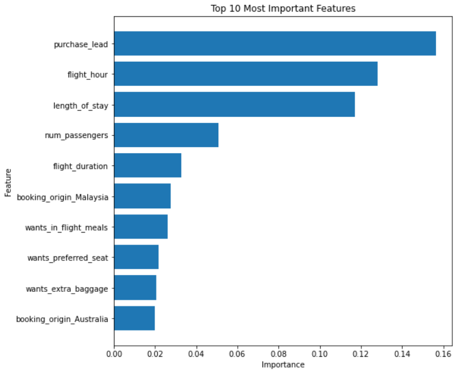

# **British Airways: Virtual Internship**

## Project Overview
This project aims to leverage data analytics and machine learning to derive insights and predict customer behavior in the context of airline reviews. The project is structured into three main tasks:

1. **Web Scraping & Data Analysis:** Extract review data from [Skytrax](https://www.airlinequality.com/airline-reviews/british-airways) and perform analytical explorations such as data analysis and visualizations.
2. **Sentiment Analysis:** Conduct sentiment analysis on the collected reviews to gauge customer sentiment.
3. **Predictive Modeling:** Develop a predictive model to forecast customer booking behavior.

Each task is encapsulated in its own dedicated directory, containing Colab notebooks with detailed implementations and instructions.

---

## Task 1: Web Scraping & Data Analysis (`Task_1_Web_Scrapping_&_Data_Analysis`)
### Objective:
Scrape review data from the [Skytrax website](https://www.airlinequality.com/airline-reviews/british-airways).

### Key Steps:
- **Data Collection:** Utilize the provided Colab Notebook to scrape review data.

### Resources:
- Colab Notebook for data collection and initial analysis.
- ReviewData - British_Airways.csv , this is the webscrapped data file saved in .csv format at the end of the colab notebook.
### Run on Colab: 

---

## Task 2: Sentiment Analysis (`Task_2_Sentiment_Analysis`)
### Objective:
Conduct sentiment analysis on the airline reviews to understand customer sentiment trends and patterns.

### Key Steps:
- **Data Preparation:** Ensuring the data is clean and structured appropriately for sentiment analysis.
- **Sentiment Analysis:** Apply sentiment analysis, topic modeling and word clouds to uncover patterns and insights from the review data to assess and categorize the sentiment of each review.
- **Insight Presentation:** Summarize the findings concisely in a PowerPoint slide for managerial presentation, focusing on key metrics and insights.

### Resources:
- Colab Notebook for sentiment analysis.
- PowerPoint Template for summarizing findings.
### Run on Colab: 

### Visualizations:
- Bar graph for Sentiment Analysis:  
- Trends of Rating by Aircraft Flown: 
---

## Task 3: Predictive Modeling (`Task_3_Predictive_modelling`)
### Objective:
Develop a predictive model to forecast the likelihood of a customer making a booking based on the insights derived from the review data.

### Key Steps:
- **Data Exploration & Preparation:** Understand the dataset's structure, perform statistical analysis, and prepare the data for modeling.
- **Model Training:** Train a machine learning model, such as a RandomForest, to predict customer booking behavior.
- **Model Evaluation:** Assess model performance using cross-validation and relevant metrics. Visualize the contribution of each variable to the model's predictive power.
- **Findings Presentation:** Compile the key results and model insights into a single PowerPoint slide for executive presentation.

### Resources:
- Colab Notebook for data exploration
- Colab Notebook for model training and evaluation.
- PowerPoint Template for summarizing model insights and findings.
### Run on Colab: 

### Visualizations:
- Confusion Matrix:
    
- Feature Importance:
    
---
